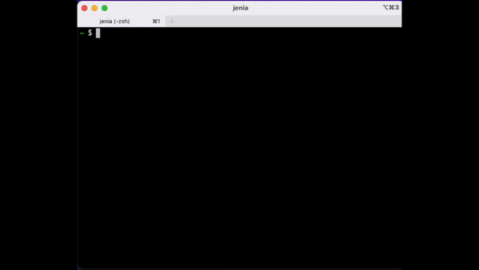

# WebTidebox

WebTidebox exposes TidalCycles development/performance environment as a web page.

Forget the involved non-deterministic TidalCycles install process. Just fire up
this one docker container, point your browser at its home page and you're good
to start live-coding.

WebTidebox is based on (is a fork of) [https://github.com/efairbanks/supertidebox](efairbanks/supertidebox).

## Demo



## Features

The package includes everything TidalCycles install documentation promises you,
but working and configured for you.

Provides
* Supercollider (3.11) with SC3-Plugins
* TidalCycles 1.7.8
* A web page to write your code live.

## Get coding

1. Have [Docker](https://www.docker.com/) installed.
1. Run ephmeeral docker container:

	```docker run -it --rm -p 8080:80 parabolala/webtidebox:1```

The first time you run it, the docker image of about 4GiB will be downloaded.
Bear with this one-time setup.

## Tips & tricks

* When you get in, you will be placed in a customized [screen](https://www.gnu.org/software/screen/manual/screen.html) session
* `ctrl-C ctrl-C` executes line
* `ctrl-C ctrl-E` executes block
* `ctrl-A ,` and `ctrl-A .` cycle through windows
* `ctrl-A D` disconnects

## Caveats

* The editor is Emacs.
* Docker image is 4GiB.
* FFMpeg dropped ffserver. This uses a forked copy of an older version of
  FFMpeg. This should be fine, but alternatives should be considered.
* There's some latency when streaming over ffmpeg. It's gonna happen. If you
  fall too far out of sync, refresh the page.
